# DOKUMEN SPESIFIKASI KREATIF & STORYBOARD KAMPANYE VIDEO
## **MEREMPAH — *Warisan Aksioma Nusantara***

---

### **INFORMASI DOKUMEN & METADATA**

| Parameter | Spesifikasi Proyek |
| :--- | :--- |
| **Klasifikasi Keamanan** | INTERNAL — RAHASIA PERUSAHAAN (CONFIDENTIAL) |
| **Versi Dokumen** | 1.0 |
| **Penyusun** | Tim Konsultan Kreatif Merempah |
| **Tanggal Efektif** | 27 Juni 2026 |
| **Durasi Target** | 60 - 90 Detik |
| **Format Produksi** | • **Vertical (9:16)**: Optimalisasi Reels / TikTok • **Horizontal (16:9)**: Optimalisasi YouTube / Presentasi |
| **Karakter Visual (Tone)** | Sinematik Gelap (*Dark Cinematic*), Maskulin (*Masculine*), *Grounded*, Dramatis |
| **Karakter Narasi (Tone)** | Minimalis & Impresif — Mengutamakan kekuatan visual (*visual storytelling*) dan rancangan suara (*sound design*) tanpa narasi suara (*voiceover*) yang berlebihan. |

---

## **I. KONSEP KREATIF UTAMA (CREATIVE DIRECTION)**

> **"Sebelum ada gelas, ada akar. Sebelum ada kafe, ada kebun."**

Kampanye video ini dirancang bukan sekadar untuk mempromosikan produk minuman, melainkan untuk mengomunikasikan **reaktualisasi warisan nusantara dalam bentuk yang modern dan relevan**. Pendekatan visual wajib mengadopsi estetika dokumenter premium (*high-end documentary style*) dan menghindari pendekatan iklan komersial konvensional (*mainstream café advertising*).

---

## **II. MATRIKS REFERENSI ESTETIKA (MOOD & TONE)**

| Dimensi Estetika | Referensi & Panduan Teknis |
| :--- | :--- |
| **Sinematografi** | Setara dengan standar dokumenter *National Geographic*, estetika *Apple Shot on iPhone*, serta kampanye premium *Nespresso*. |
| **Palet Warna** | *Dark earthy tones* — Dominasi hitam vulkanik (*volcanic black*), hijau tua (*deep green*), jingga tua (*ochre amber*), dan emas hangat (*warm gold*). |
| **Editing & Ritme** | Tempo pemotongan lambat (*slow cut*), transisi berbasis tekstur (*match-cut on texture*), dan desain suara alami yang intens (*natural sound design*). |
| **Ilustrasi Musik** | Komposisi instrumental — Kombinasi ketukan perkusi etnik Jawa dengan aransemen gesek modern (*modern strings*). **Catatan:** Hindari musik gamelan tradisional penuh. |
| **Batasan Visual (Dihindari)** | Warna-warna pastel, filter kecantikan (*beauty filter*), efek tipografi/gimmick teks yang berlebihan, dan pengambilan gambar udara (*drone footage*) generik. |

---

## **III. RINCIAN SHOT-BY-SHOT STORYBOARD**

---

### **BABAK 1 — HOOK (00:00 – 00:07)**
* **Tujuan Strategis:** Menghentikan aktivitas gulir layar pengguna (*thumb-stopper*) dan memaksa retensi penonton sejak detik pertama.

#### **Shot 1.1** | **Durasi:** `00:00 – 00:03` (3 Detik)
* **Angle & Framing:** *Extreme Close-Up* (ECU), *Macro*
* **Subjek Visual:** Tangan yang merepresentasikan pekerja lapangan/petani (bukan tangan halus), sedang memegang rimpang jahe merah basah yang baru dicabut dengan sisa tanah yang masih menempel erat di sela-sela jari.
* **Pencahayaan:** Pencahayaan dramatis satu arah (*single light source*) dari arah kiri samping (*side lighting*), menghasilkan bayangan yang panjang dan tegas (*high contrast*).
* **Palet Warna:** *Ochre* cokelat, hitam pekat, merah tua jahe.
* **Audio & Suara:** Diawali keheningan total (*absolute silence*), disusul suara robekan tanah basah dan akar yang tercabut dari tanah (*foley sound*).
* **Catatan Tambahan:** Tidak ada elemen teks maupun logo yang muncul pada shot ini.

#### **Shot 1.2** | **Durasi:** `00:03 – 00:07` (4 Detik)
* **Angle & Framing:** *Medium Close-Up* (MCU), *Low Angle*
* **Subjek Visual:** Rimpang jahe diletakkan di atas permukaan batu andesit hitam yang basah. Divisualisasikan dengan teknik *slow-motion* di mana tetesan air memantul dinamis dari permukaan batu.
* **Pencahayaan:** Efek pencahayaan *golden hour* dari arah belakang (*backlight*) yang menghasilkan siluet bercahaya (*silhouette halo*) di sekeliling ujung rimpang jahe.
* **Palet Warna:** Hitam batu andesit (*deep black stone*), kuning keemasan (*amber gold backlight*).
* **Audio & Suara:** Suara gemericik air dan tetesan yang jernih. Selanjutnya, masuk ketukan perkusi etnik pertama secara tunggal dan bertenaga.
* **Transisi Editing:** Pemotongan tajam (*hard cut*) menuju babak berikutnya tepat pada ketukan pertama musik instrumen.

---

### **BABAK 2 — TENSION / DUNIA LUAR (00:07 – 00:22)**
* **Tujuan Strategis:** Membangun kontras realitas sosial (konflik/kebutuhan konsumen) sebelum menghadirkan solusi dari Merempah.

#### **Shot 2.1** | **Durasi:** `00:07 – 00:10` (3 Detik)
* **Angle & Framing:** *Wide Shot* (WS), *Eye-Level*
* **Subjek Visual:** Perspektif trotoar jalan raya Kota Malang. Menampilkan mobilitas lalu lintas yang cepat, kepulan kabut knalpot, dan atmosfer sibuk di jam padat (pagi atau sore hari).
* **Gaya Editing:** Efek selang waktu singkat (*time-lapse*). Siluet manusia bergerak cepat menyerupai bayangan.
* **Audio & Suara:** Suara riuh lanskap kota — klakson, deru mesin kendaraan, dan kebisingan urban. Menghasilkan kontras tajam dari kesunyian Babak 1.

#### **Shot 2.2** | **Durasi:** `00:10 – 00:14` (4 Detik)
* **Angle & Framing:** *Close-Up* (CU), *Handheld* dengan getaran halus (*shake*)
* **Subjek Visual:** Wajah seorang profesional urban (usia perkiraan 25–32 tahun) menatap kosong ke layar laptop dengan mata lelah. Terlihat cangkir kopi kosong di samping meja kerja. Tanpa ekspresi senyum.
* **Pencahayaan:** Pantulan cahaya biru (*cool blue light*) dari layar monitor ke wajah subjek, membangun kesan dingin.
* **Palet Warna:** Didominasi warna biru abu-abu, flat, dan kurang jenuh (*desaturated*).
* **Audio & Suara:** Suara ketukan keyboard, notifikasi perangkat elektronik, dan kebisingan kota yang sayup-sayup terdengar dari balik jendela.

#### **Shot 2.3** | **Durasi:** `00:14 – 00:18` (4 Detik)
* **Angle & Framing:** *Over-The-Shoulder* (OTS), *Medium Shot*
* **Subjek Visual:** Antrean pelanggan di sebuah kafe jaringan (*chain café*). Di atas meja konter, berjejer minuman berwarna cerah yang terlihat generik, menggunakan gelas plastik, dan berbasis sirup pemanis.
* **Gaya Editing:** Gambar sengaja dibuat sedikit kurang pencahayaan (*underexposed*) untuk menciptakan impresi visual yang datar, dingin, dan tidak menarik.
* **Audio & Suara:** Kebisingan latar (*ambient noise*) khas kafe populer/mainstream.

#### **Shot 2.4** | **Durasi:** `00:18 – 00:22` (4 Detik)
* **Angle & Framing:** *Extreme Close-Up* (ECU)
* **Subjek Visual:** Tangan seseorang sedang menyobek sachet bubuk minuman instan. Label sachet menunjukkan gambar ilustrasi rempah, namun secara visual terlihat berkualitas rendah/murah.
* **Audio & Suara:** Suara robekan kertas/plastik sachet yang berisik, disusul keheningan mendadak (*abrupt silence*).
* **Transisi Editing:** Transisi memudar perlahan ke hitam sempurna (*fade to black*). Sunyi total selama 1 detik.

> **Catatan Konseptual Babak 2:** Penonton harus dihadapkan pada rasa kekosongan, kelelahan mental, dan kejenuhan dunia modern. Visualisasi mengarahkan mereka untuk mendambakan sesuatu yang autentik.

---

### **BABAK 3 — RESOLVE / MASUK MEREMPAH (00:22 – 00:50)**
* **Tujuan Strategis:** Memperkenalkan ekosistem Merempah sebagai antitesis total dari penatnya dunia luar. Menampilkan suasana hangat, riil, dan bernilai.

#### **Shot 3.1** | **Durasi:** `00:22 – 00:26` (4 Detik)
* **Angle & Framing:** *Low Angle*, *Wide Shot*
* **Subjek Visual:** Pintu kayu berpadu besi tempa gerai Merempah terbuka perlahan. Pancaran cahaya kuning hangat (*amber light*) menyeruak keluar dari dalam gerai, disertai kepulan tipis uap hangat di area pintu masuk.
* **Pencahayaan:** Kontras antara cahaya *tungsten* hangat dari interior dengan cahaya alami siang hari (*daylight*) di eksterior.
* **Audio & Suara:** Suara derit kayu/besi pintu yang terbuka. Disusul audio proses perebusan rempah (gelembung air mendidih, embusan uap). Musik pengiring mulai masuk secara perlahan (*fade in*).

#### **Shot 3.2** | **Durasi:** `00:26 – 00:31` (5 Detik)
* **Angle & Framing:** *Macro Close-Up* (MCU), *Top-Down* (90 derajat tegak lurus)
* **Subjek Visual:** Panci tembaga atau wadah tanah liat tradisional di atas tungku/kompor api. Potongan jahe segar, serai, dan kunyit mendidih dalam air jernih yang perlahan berubah warna menjadi kuning keemasan. Uap air mengepul lembut ke arah lensa kamera.
* **Pencahayaan:** Cahaya oranye hangat (*warm amber*) dari arah bawah tungku berpadu dengan cahaya alami dari samping (*natural side light*).
* **Audio & Suara:** Detail suara air mendidih (*bubbling and simmering*). Efek suara harus sangat organik dan tajam untuk membangkitkan sensasi indra penonton.

#### **Shot 3.3** | **Durasi:** `00:31 – 00:36` (5 Detik)
* **Angle & Framing:** *Medium Shot* (MS) memfokuskan pada Barista
* **Subjek Visual:** Gerakan tangan barista yang terampil dan presisi sedang menuangkan cairan konsentrat rempah ke dalam gelas kaca melalui saringan halus. Cairan kuning keemasan mengalir jernih tanpa ampas dengan ritme yang tenang.
* **Pencahayaan:** Arah cahaya dari belakang (*backlit*), membuat cairan rempah yang dituangkan tampak berkilau keemasan kontras dengan latar belakang gelap.
* **Palet Warna:** Kuning madu (*amber*), emas (*gold*), dengan latar belakang gelap (*dark background*).
* **Audio & Suara:** Suara kental cairan yang dituangkan. Volume musik pengiring meningkat secara bertahap.

#### **Shot 3.4** | **Durasi:** `00:36 – 00:41` (5 Detik)
* **Angle & Framing:** *Macro*, *Eye-Level*
* **Subjek Visual:** **THE MONEY SHOT (HERO SHOT)**. Tetesan air perasan jeruk nipis segar jatuh ke dalam gelas berisi air seduhan bunga telang berwarna biru cerah. Terjadi reaksi kimia alami di mana warna air berubah secara perlahan dan estetik dari biru langit menjadi ungu tua. Pengambilan gambar menggunakan teknik *high frame rate* (minimal 120fps untuk efek *slow-motion* dramatis).
* **Pencahayaan:** Latar belakang gelap, satu titik pencahayaan belakang (*single backlight*), memosisikan gelas sebagai pusat cahaya utama.
* **Audio & Suara:** Suara tetesan air yang diperlambat secara dramatis (*slow motion sound design*). Musik mencapai bagian puncak (*crescendo*).
* **Catatan Produksi:** Shot ini adalah representasi utama kualitas produk. Wajib mengalokasikan durasi syuting dan percobaan terbanyak pada shot ini (target minimal 10–15 kali pengambilan gambar/take).

#### **Shot 3.5** | **Durasi:** `00:41 – 00:50` (9 Detik)
* **Angle & Framing:** *Wide Shot* (WS) menyorot suasana ruang (*ambiance*)
* **Subjek Visual:** Ruang interior Merempah. Terlihat beberapa pelanggan sedang bekerja dengan tenang (*Work From Café*), didukung pencahayaan amber hangat, dekorasi tanaman hijau alami, meja kayu solid, dan laptop terbuka. Ruangan terisi secara proporsional (tidak sepi, namun juga tidak terlalu padat).
* **Pencahayaan:** Sorotan cahaya senja (*golden hour window light*) dari arah jendela sisi kiri.
* **Gaya Editing:** Efek kedalaman ruang yang sempit (*shallow depth of field* / latar belakang buram) demi menghasilkan visual sinematik layaknya film layar lebar.
* **Audio & Suara:** Ambience kafe yang tenang — suara ketikan keyboard halus, benturan cangkir kaca, dan musik instrumen bertempo rendah.

---

### **BABAK 4 — PROOF / REAKSI NYATA (00:50 – 01:10)**
* **Tujuan Strategis:** Memberikan bukti nyata (*social proof*) tanpa kesan testimoni buatan. Menangkap momen ekspresi autentik pelanggan.

#### **Shot 4.1** | **Durasi:** `00:50 – 00:55` (5 Detik)
* **Angle & Framing:** *Candid*, *Medium Close-Up* (MCU)
* **Subjek Visual:** Momen jujur saat seorang pelanggan pertama kali menghirup uap aroma dari gelas Merempah. Terlihat ekspresi wajah alami — alis sedikit terangkat, senyum kecil kejutan yang positif. Menghindari akting berlebihan.
* **Catatan Produksi:** Sutradara dilarang memberikan instruksi akting. Berikan produk secara langsung dan rekam reaksi spontan subjek.

#### **Shot 4.2** | **Durasi:** `00:55 – 01:00` (5 Detik)
* **Angle & Framing:** *Over-The-Shoulder* (OTS)
* **Subjek Visual:** Dua pelanggan duduk berhadapan. Salah satunya meneteskan jeruk nipis ke dalam seduhan telang biru. Perubahan warna terjadi, memicu respons kagum dari temannya yang secara spontan mengangkat ponsel pintar untuk mengabadikan momen tersebut.
* **Audio & Suara:** Suara tawa kecil dan bisikan spontan: *"Kok bisa?!"*. Audio ini dipertahankan jika terekam secara natural, namun dihilangkan jika terdengar dipaksakan.

#### **Shot 4.3** | **Durasi:** `01:00 – 01:05` (5 Detik)
* **Angle & Framing:** *Macro Shot* (Sangat Dekat)
* **Subjek Visual:** Bibir gelas saat bersentuhan dengan bibir pelanggan pada sesapan pertama. Cairan rempah mengalir masuk perlahan.
* **Pencahayaan:** Cahaya samping yang hangat (*warm side light*).
* **Audio & Suara:** Detail suara sesapan halus (*subtle gulp sound*).

#### **Shot 4.4** | **Durasi:** `01:05 – 01:10` (5 Detik)
* **Angle & Framing:** *Medium Shot* (MS)
* **Subjek Visual:** Pelanggan menurunkan gelas kembali ke meja, lalu tersenyum kecil secara tulus. Arah pandang mata tertuju ke rekan bicaranya atau ke arah jendela luar (tidak menghadap langsung ke arah kamera).
* **Audio & Suara:** Volume musik pengiring mulai meningkat kembali (*fade up*), seiring suara lingkungan (*natural sounds*) diturunkan perlahan.

---

### **BABAK 5 — CALL TO ACTION (CTA) / PENUTUP (01:10 – 01:20)**
* **Tujuan Strategis:** Menanamkan ingatan merek (*brand recall*) dan mengarahkan tindakan penonton secara persuasif namun elegan.

#### **Shot 5.1** | **Durasi:** `01:10 – 01:14` (4 Detik)
* **Angle & Framing:** *Top-Down* (90 Derajat), Komposisi Simetris Sempurna (*Perfect Symmetry*)
* **Subjek Visual:** Tampilan *flat lay* dari dua gelas sajian Merempah di atas meja kayu bertekstur gelap. Di sekelilingnya didekorasi dengan rimpang rempah segar, helai daun serai, dan cangkir tanah liat kecil berisi rempah kering. Sebuah tangan masuk ke dalam frame dan mengambil salah satu gelas.
* **Palet Warna:** Selaras dengan identitas visual merek — kayu gelap, hijau daun, kuning keemasan.
* **Audio & Suara:** Aransemen musik mencapai klimaks (*peak*), disusul satu ketukan instrumen drum etnik sebagai penanda akhir.

#### **Shot 5.2** | **Durasi:** `01:14 – 01:17` (3 Detik)
* **Angle & Framing:** *Static Shot*
* **Subjek Visual:** Layar transisi hitam pekat. Logo **MEREMPAH** muncul perlahan (*fade in*) berwarna putih bersih. Di bawah logo, tersemat sub-teks miring (*italic*): *"Warisan Aksioma Nusantara"*.
* **Gaya Animasi:** Transisi masuk (*fade in*) berdurasi 1.5 detik tanpa adanya gerakan grafis (*motion graphic*) yang berlebihan.

#### **Shot 5.3** | **Durasi:** `01:17 – 01:20` (3 Detik)
* **Angle & Framing:** *Static Shot*
* **Subjek Visual:** Layar hitam berlanjut. Kalimat penutup (*tagline*) kampanye muncul perlahan di bagian tengah:
  
  **"Datang sekali. Ceritakan selamanya."**
  
  Di bagian bawah, tertera informasi akun media sosial resmi: **@merempah.idn**
* **Audio & Suara:** Musik pengiring berakhir sempurna. Layar meredup perlahan dalam kesunyian (*fade out to silence*).

---

## **IV. PANDUAN PELAKSANAAN PRODUKSI (PRODUCTION GUIDELINES)**

### **1. Alokasi Tim Minimum (Crew Requirements)**

| Peran Kunci | Deskripsi & Spesifikasi Kebutuhan |
| :--- | :--- |
| **Director of Photography (DoP)** | 1 Orang. Bertanggung jawab atas visual, mengoperasikan kamera mirrorless dengan spesifikasi sensor minimal setara *Sony A7III* atau di atasnya. |
| **Gaffer / Lighting Assistant** | 1 Orang. Mengatur pencahayaan, minimal menyediakan 2 unit LED Panel dengan opsi suhu warna hangat (*warm light*). |
| **Talent (Aktor/Model)** | 2–3 Orang. Karakteristik wajah natural, representasi masyarakat urban, tidak kaku, dan memiliki ekspresi yang autentik di depan kamera. |
| **Food & Prop Stylist** | 1 Orang. Bertanggung jawab atas estetika penyajian minuman, penataan bahan rempah mentah, dan penataan properti pendukung syuting. |
| **Sutradara (Director)** | 1 Orang. Bertanggung jawab atas jalannya cerita (dapat dirangkap oleh Owner atau *Creative Director*). |

### **2. Inventaris Peralatan Kritis (Critical Equipment)**
* **Sistem Kamera:** Sony A7III / Fujifilm X-T5 / Blackmagic Pocket Cinema Camera (BMPCC) 6K.
* **Lensa:** Lensa prime 35mm f/1.4 (untuk pengambilan gambar candid dan ambiance ruang); Lensa 90mm Macro (khusus shot close-up rimpang dan detail tekstur bahan).
* **Kemampuan High Frame Rate:** Kamera wajib mendukung perekaman minimal 120fps pada resolusi 1080p untuk adegan tetesan jeruk nipis (*money shot*).
* **Sistem Pencahayaan:** 2x LED Warm Panel + 1x Small Practical Light (sumber cahaya kecil seperti lilin atau lampu tungsten mini).
* **Properti Syuting (Props):** Panci tembaga/tanah liat tradisional, batu andesit bertekstur, rimpang rempah segar (jahe merah, kunyit, serai), dan gelas kaca bening berkualitas tinggi.

### **3. Lini Masa Produksi (Production Timeline)**

```mermaid
gantt
    title Estimasi Jadwal Produksi Kampanye Merempah (~2 Minggu)
    dateFormat  D
    axisFormat %e

    section Pra-produksi
    Persiapan Properti & Casting Talent   :active, des1, 1, 5
    
    section Produksi
    Hari Syuting (06.00 - 18.00)          :crit, des2, 6, 6
    
    section Pascaproduksi
    Editing Kasar (Rough Cut)             :des3, 7, 9
    Color Grading                         :des4, 10, 11
    Review Internal & Revisi              :des5, 12, 14
```

* **Pra-produksi:** 3 - 5 Hari (Persiapan logistik, properti, dan pemilihan talent)
* **Hari Syuting:** 1 Hari Penuh (Estimasi jam kerja: 06:00 – 18:00 WIB)
* **Editing Kasar:** 2 - 3 Hari (Penyusunan shot sesuai storyboard)
* **Color Grading:** 1 - 2 Hari (Penyesuaian warna sinematik)
* **Review & Revisi:** 2 - 3 Hari (Finalisasi detail visual dan audio)

### **4. Spesifikasi Pewarnaan (Color Grading Guide)**
* **Shadows (Area Gelap):** Diberikan sentuhan warna hijau gelap (*deep green*) / warna *teal* tipis pada bayangan.
* **Midtones (Area Menengah):** Diberikan sentuhan warna amber hangat (*warm amber*) / cokelat tanah (*ochre*).
* **Highlights (Area Terang):** Diberikan warna putih gading hangat (*creamy warm white*). **Peringatan:** Jangan menggunakan warna putih kebiruan/dingin (*cool blue*).
* **Impresi Akhir:** Karakter visual menyerupai film seluloid 35mm klasik dengan bayangan yang sedikit gelap (*underexposed shadows*) namun tetap hangat pada bagian highlight.

---

## **V. RENCANA DISTRIBUSI & KONTEN TURUNAN (DERIVATIVE CONTENT)**

Untuk memaksimalkan efisiensi produksi 1 hari syuting, aset rekaman akan dikembangkan menjadi beberapa format konten sebagai berikut:

| Kategori Konten | Format Platform | Target Durasi | Fokus Visual |
| :--- | :--- | :--- | :--- |
| **Main Campaign Video** | YouTube / Presentasi Klien | 60 - 90 Detik | Narasi lengkap Babak 1 s.d. Babak 5 |
| **Reels/TikTok Hook Cut** | Instagram Reels / TikTok | 15 - 30 Detik | Fokus pada Hook cepat dan Money Shot |
| **Visual Loop Telang** | Instagram Reels / TikTok | 7 - 10 Detik | Video loop estetik reaksi kimia telang & jeruk |
| **Simmering Rempah Loop** | Instagram Stories | 5 - 7 Detik | Visual mikro uap air mendidih panci tembaga |
| **Still Photography Set** | Feed Instagram / Website | 10 - 15 Foto | Foto produk beresolusi tinggi, bahan baku, & suasana |
| **Behind The Scenes (BTS)** | Instagram Stories | Unedited / Raw | Cuplikan proses syuting di balik layar |

---

## **VI. CATATAN AKHIR & ARAHAN KREATIF**

> Kampanye ini dirancang bukan sekadar untuk menjual produk minuman kemasan. Ini adalah sebuah gerakan untuk memperkenalkan cara pandang baru kepada generasi modern: bahwa warisan leluhur nusantara dapat dihadirkan dalam bentuk yang relevan, elegan, bermartabat, dan diinginkan.
>
> Setiap bingkai (*frame*) yang diproduksi harus mampu menjawab satu parameter evaluasi: 
> **"Apakah adegan ini mampu membangkitkan keinginan penonton untuk hadir langsung di gerai?"**
>
> Jika jawabannya **Ya**, maka shot tersebut layak digunakan. Jika tidak, proses pengambilan gambar wajib diulang.

---

*Dokumen ini bersifat rahasia dan hanya ditujukan untuk penggunaan internal Tim Kreatif Merempah.*  
*Dilarang keras menyebarluaskan dokumen ini tanpa izin tertulis dari direksi PT Seduhlur Indo Group.*

**PT SEDUHLUR INDO GROUP**  
*Kota Malang, Provinsi Jawa Timur, Indonesia*
